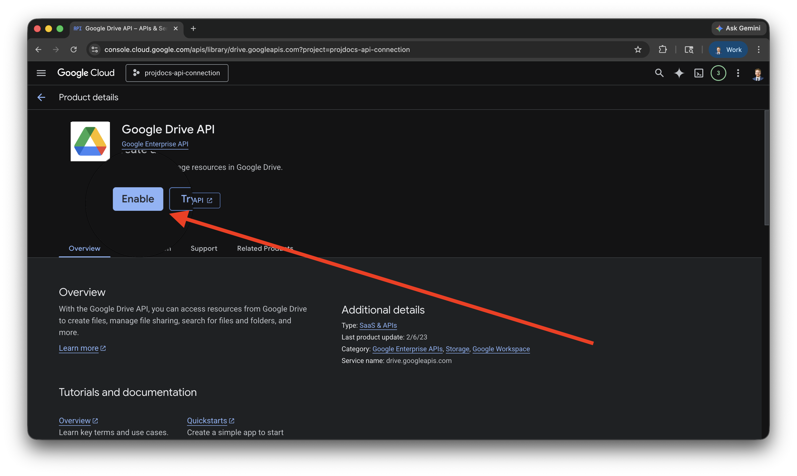
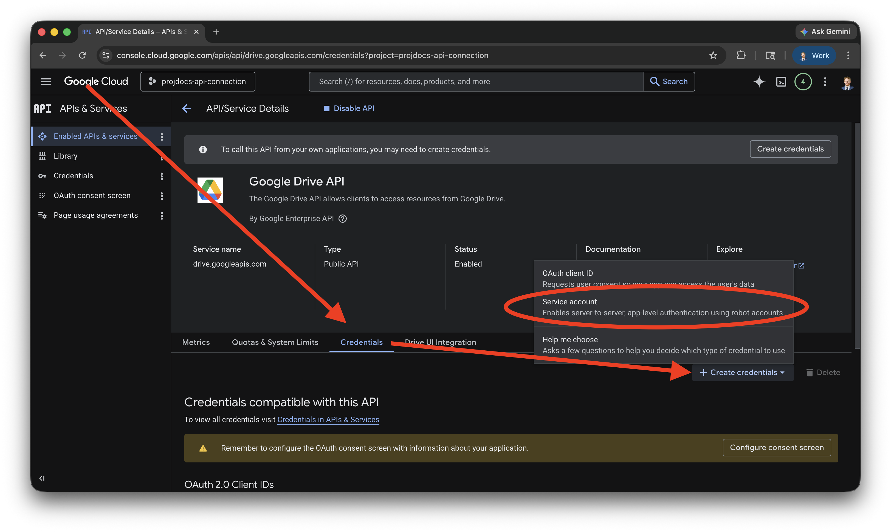
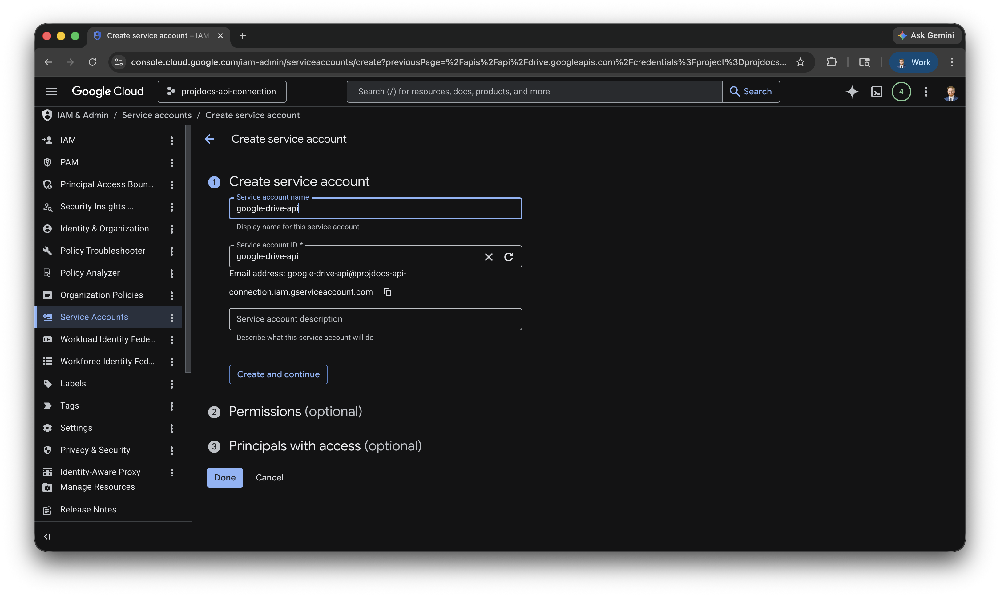
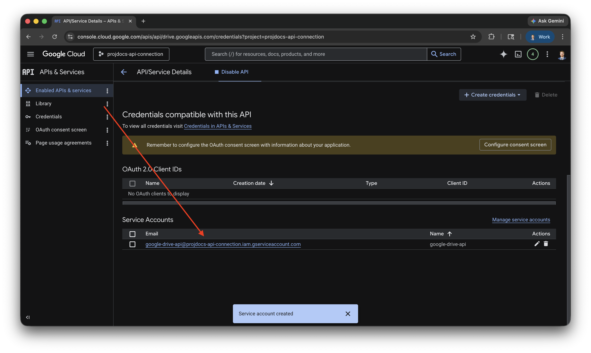
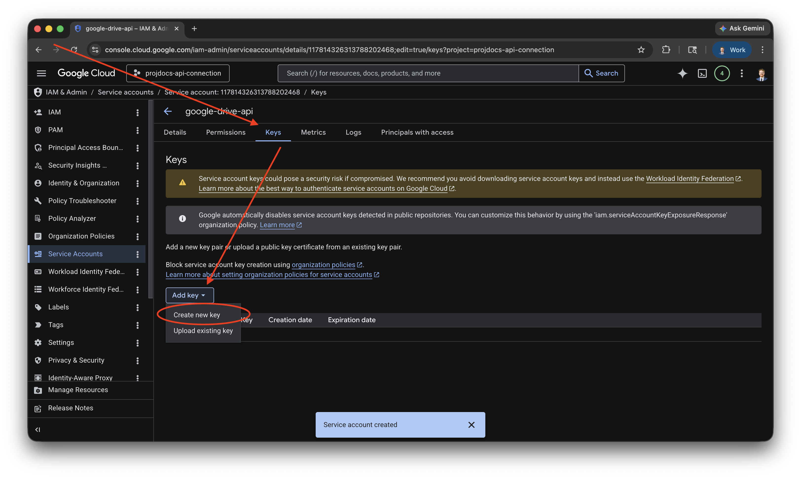
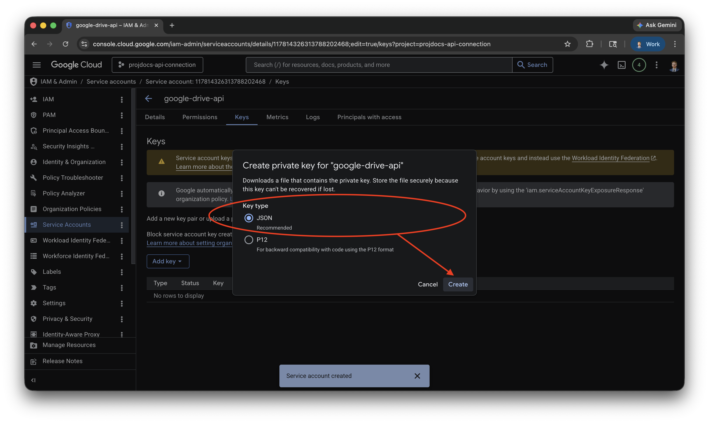
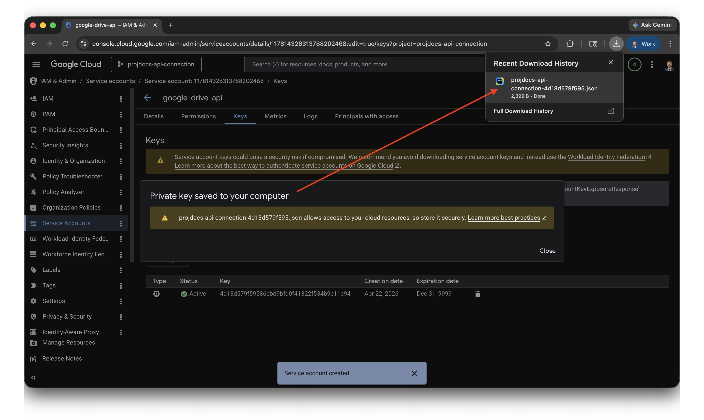
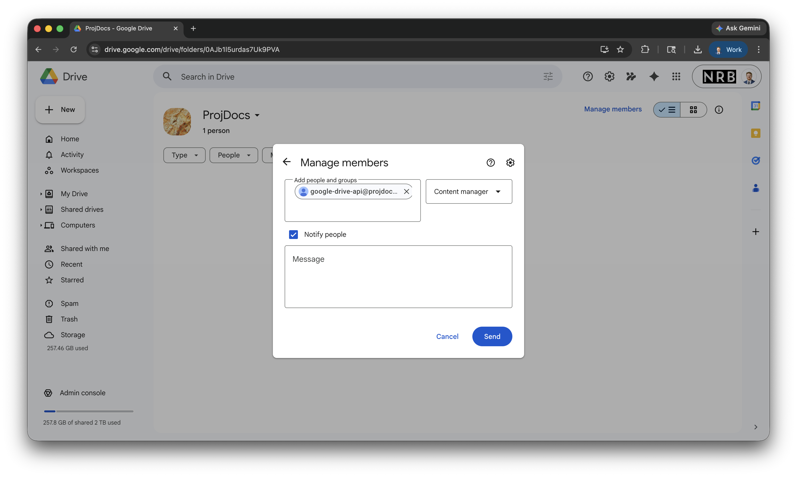
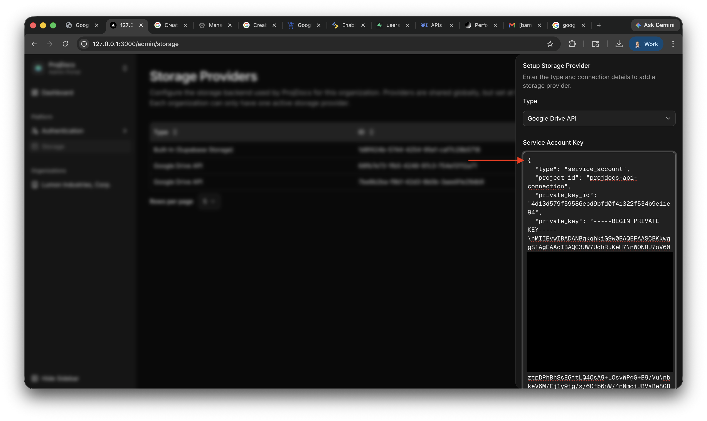
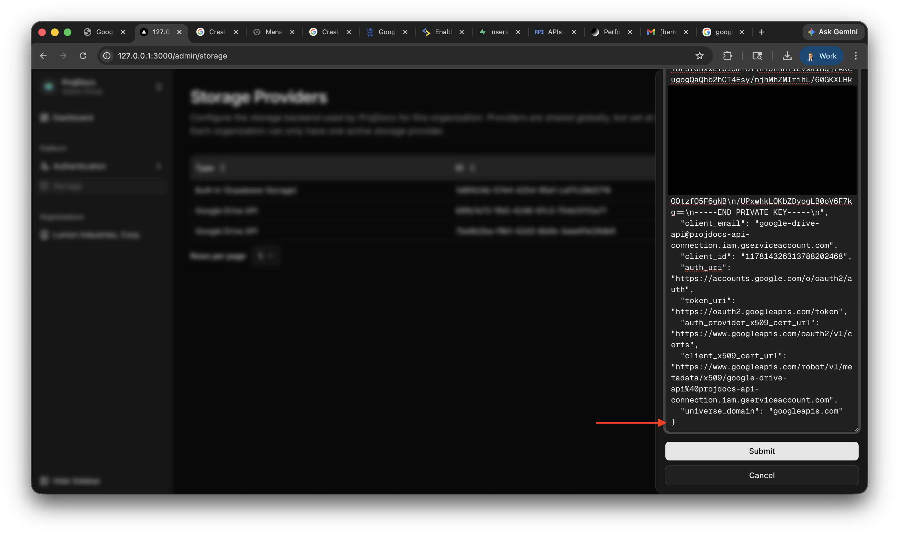

# Background

Google Workspace customers can connect their existing

# Setup

## Obtain API Credentials

1. Login to [Google Cloud Console](https://console.cloud.google.com/).

2. Select an [existing project](https://console.cloud.google.com/cloud-resource-manager), or [create a new one](https://developers.google.com/workspace/guides/create-project). In this demonstration, the project-id is `projdocs-api-connection`.

3. In your project, enable the [Google Drive API](https://console.cloud.google.com/marketplace/product/google/drive.googleapis.com).

4. Create a new service account.

<Card>
  When creating the service account, as shown in the above step, no optional permissions or principals are required.
</Card>

5. Create a JSON key for the service account.

## Share Storage with Service Account

Take note of the Service Account's email address. In the downloaded key file, this value is the `client_email` key.

Now, create a new Shared Google Drive, or a Google Drive Folder, and share that with the Service Account's email address.

## Upload API Credentials to ProjDocs

Create a new storage provider in ProjDocs Admin (`/admin/storage`).

For the type, select `Google Drive API`.

For the `Service Account Key`, copy and paste the entire contents of the file downloaded earlier.

Be sure to include the opening and closing brackets.

